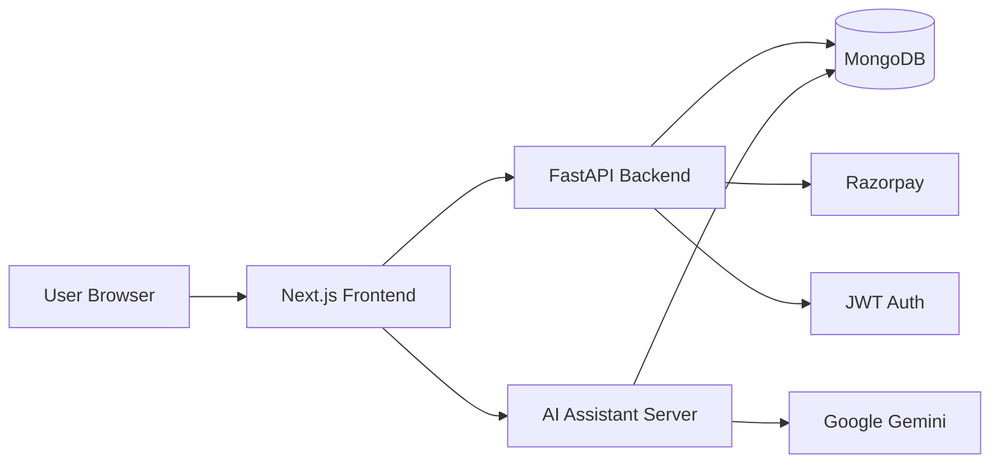

# One-Page System Design

## System overview

Super Commerce is a modular e-commerce platform that separates three major responsibilities:

- storefront and user experience in Next.js
- commerce logic and persistence in FastAPI + MongoDB
- shopping assistant and product retrieval in Express + LangGraph + MongoDB vector search

## High-level architecture

## Components

### 1. Frontend

Technology: Next.js 16, React 19, TypeScript, Tailwind CSS

Responsibilities:

- product browsing and filters
- cart and wishlist actions
- login, registration, and order flow
- mobile-friendly storefront UI
- admin product management screens

### 2. Backend API

Technology: FastAPI, Python, Motor, JWT, Pydantic

Responsibilities:

- authentication and authorization
- CRUD for products, categories, and brands
- cart, wishlist, and order APIs
- payment order creation and verification
- review handling and admin operations

### 3. AI assistant

Technology: Express.js, TypeScript, LangChain, LangGraph, MongoDB Atlas vector search

Responsibilities:

- convert user shopping questions into product search actions
- perform vector-based semantic retrieval
- fall back to text searches when vector results are empty
- keep conversation state using MongoDB-backed checkpoints

### 4. Data layer

Technology: MongoDB

Uses:

- transactional collections for users, carts, orders, reviews, and products
- vector collection for semantic product retrieval
- shared data model across storefront and AI modules

## Request flow

### Product browsing flow

1. User opens storefront or product list.
2. Frontend requests product data from FastAPI backend.
3. FastAPI queries MongoDB with filters such as category, brand, and price.
4. Results are returned to the storefront and rendered in the UI.

### Checkout flow

1. User adds products to cart.
2. Backend updates the cart collection.
3. Order is created in MongoDB.
4. Payment order is generated through Razorpay.
5. Payment verification updates order status.

### AI shopping flow

1. User asks a natural-language shopping question.
2. Express AI server receives the request.
3. LangGraph agent invokes the product lookup tool.
4. MongoDB vector search retrieves semantically relevant products.
5. Gemini synthesizes a shopping response with product recommendations and guidance.

## Non-functional considerations

- JWT-based auth protects customer and admin endpoints.
- MongoDB is used for both transactional and retrieval workflows.
- Vector search allows semantic recommendations beyond keyword matching.
- The app is designed around modular services so the storefront, commerce API, and AI assistant can evolve independently.

## Summary

This system is a lightweight but practical e-commerce architecture: a user-facing storefront, an API layer for commerce logic, and a separate AI service for product discovery. It balances simplicity, speed, and extensibility for a demo or MVP build.
